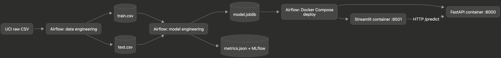

# PMLDL Assignment 1: Automated Auto MPG Deployment

This repository implements the three required stages of Assignment 1: data engineering, model engineering, and deployment. The pipeline predicts city-cycle fuel consumption (`mpg`) from vehicle properties.

The model uses the [UCI Auto MPG dataset](https://archive.ics.uci.edu/dataset/9/auto%2Bmpg) by R. Quinlan, licensed under CC BY 4.0 (DOI: 10.24432/C5859H). It has 398 rows, seven predictive features, and real missing horsepower values.

## Architecture



The Airflow DAG runs `preprocess_data -> train_and_evaluate -> deploy_api_and_app` every five minutes. `catchup=False` and `max_active_runs=1` prevent backlog and overlapping deployments.

## Repository structure

```text
code/datasets/                 Stage 1 source code
code/models/                   Stage 2 source code
code/deployment/api/           FastAPI service and Dockerfile
code/deployment/app/           Streamlit app and Dockerfile
data/raw/                      Original UCI CSV
data/processed/                Reproducible train/test artifacts and report
models/                        Packaged model and metrics
services/airflow/dags/         Scheduled end-to-end DAG
tests/                         Data, model packaging, and API tests
```

## Setup

Python 3.12 is recommended. Docker with Docker Compose is required for Stage 3. Airflow is kept in a small separate virtual environment because its official constraints intentionally pin shared web and data libraries to versions that conflict with the model-serving stack.

```bash
python3.12 -m venv .venv
source .venv/bin/activate
pip install -r requirements.txt
python3.12 -m venv .airflow-venv
.airflow-venv/bin/pip install -r requirements-airflow.txt
make download
```

The raw CSV is committed for reproducibility; `make download` refreshes it from the UCI source.

## Verify Stages 1 and 2 locally

```bash
make pipeline
make test
cat models/metrics.json
cat data/processed/preprocessing_report.json
```

Stage 1 removes duplicates, splits deterministically, imputes missing numeric values using training medians, and removes training-feature outliers using IQR bounds learned only from training data. The held-out test rows are not removed, so evaluation remains representative. Stage 2 packages feature engineering and the estimator into one sklearn pipeline, preventing training-serving preprocessing differences.

To inspect experiment tracking:

```bash
make mlflow-ui
```

Open <http://localhost:5000>.

## Deploy API and app

Create the model first, then start the two containers:

```bash
make pipeline
make deploy
docker compose -f code/deployment/docker-compose.yml ps
```

Open:

- Streamlit app: <http://localhost:8501>
- FastAPI Swagger UI: <http://localhost:8000/docs>
- API health: <http://localhost:8000/health>

Example prediction:

```bash
curl -X POST http://localhost:8000/predict \
  -H 'Content-Type: application/json' \
  -d '{"cylinders":4,"displacement":140,"horsepower":90,"weight":2500,"acceleration":15.5,"model_year":80,"origin":1}'
```

Stop the services with `make stop`.

If the default host ports are already occupied, keep the container ports unchanged and choose temporary host ports:

```bash
API_PORT=18000 APP_PORT=18501 docker compose -f code/deployment/docker-compose.yml up -d --build
```

## Run the automated pipeline with Airflow

Initialize Airflow once:

```bash
export AIRFLOW_HOME="$PWD/services/airflow"
make airflow-init
make airflow
```

Open <http://localhost:8080>, sign in with `admin` / `admin`, enable `pmldl_assignment_1`, and trigger the first run. After that, the DAG runs every five minutes. The Airflow process must have permission to access the local Docker daemon because the deployment task invokes Docker Compose.

For a clean demonstration, show a successful DAG graph, `models/metrics.json`, two running containers, `/docs`, and a prediction submitted through Streamlit.

## Reproducibility and operational notes

- Dataset split, estimator, and tests use deterministic settings.
- The API loads the packaged model once during startup and exposes a health check.
- Streamlit calls the API through the Compose service name `api`, not container-local `localhost`.
- Compose waits for API health before starting the web app.
- MLflow runs are stored in a local `mlflow.db` SQLite database and are intentionally ignored by Git.
- No credentials or external tracking services are required.

## Rubric mapping

| Criterion | Evidence |
| --- | --- |
| Data engineering | `preprocess.py`, processed CSV files, JSON cleaning report, test |
| Model engineering | sklearn pipeline, packaged model, MAE/RMSE/R2, local MLflow run |
| Deployment | separate FastAPI and Streamlit containers communicating over HTTP |
| Automation | Airflow DAG scheduled with `*/5 * * * *` |
| Structure | logical folders matching the recommended assignment layout |
